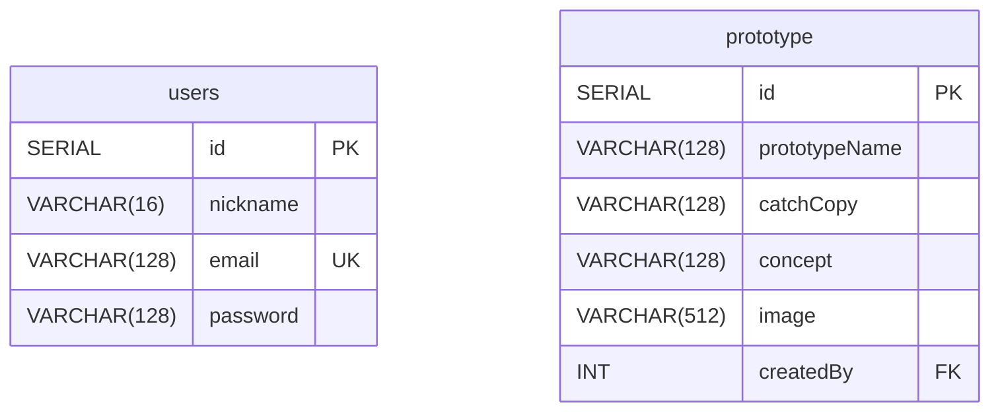

# protospace-b

## 個々人で対応するべきこと

- `protospace-b/src/main/resources/application.properties`を編集する。
- DBを作成する。

```mermaid
erDiagram
  users{
    SERIAL id PK
    VARCHAR(16) nickname
    VARCHAR(128) email UK
    VARCHAR(128) password
  }
  prototype{
    SERIAL id PK
    VARCHAR(128) prototypeName
    VARCHAR(128) catchCopy
    VARCHAR(128) concept
    VARCHAR(512) image
    INT createdBy FK
  }
```
