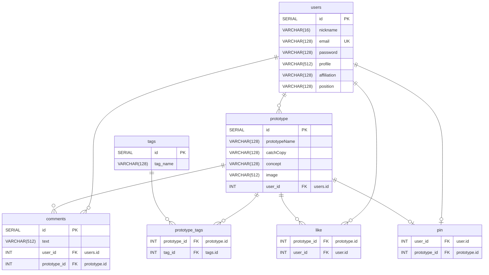

# protospace-b

## 個々人で対応するべきこと

- `protospace-b/env`を編集する。
- DBを作成する。

`protospace-b/env`
```sh
#!/usr/bin/sh
export DATABASE_URL=jdbc:postgresql://localhost:5432/protospace
export DATABASE_PASSWORD=
export DATABASE_ROLE=
```


